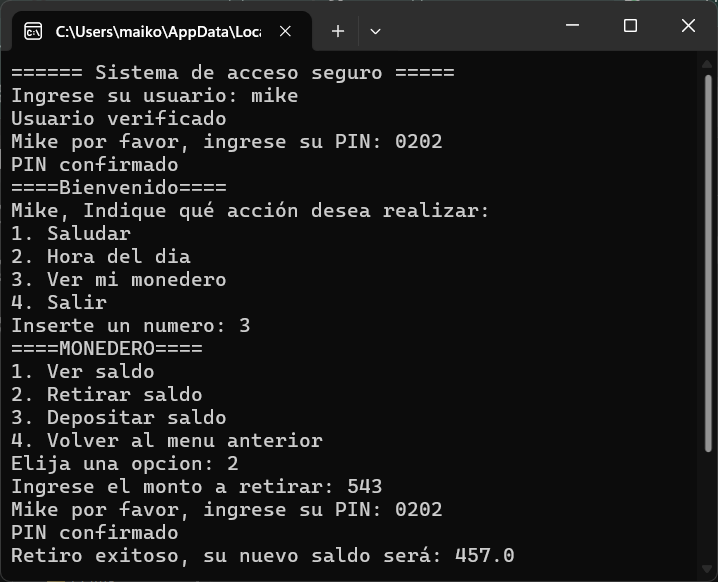

# Monedero Digital en Python

-Este proyecto está desarrollado como práctica personal para fortalecer habilidades en programación con Python.  
-La idea a futuro es llevar el proyecto a otro nivel poco a poco a a medida que se vayan adquiriendo nuevas habilidades.

-Este monedero permite gestionar saldo, movimientos y operaciones básicas desde consola, simulando una billetera digital sencilla.

---

## 🖼️ Vista previa



---

## Funcionalidades principales

- Inicio de sesión con usuario y PIN  
- Control de intentos fallidos  
- Consultar, retirar y depositar dinero  
- Validación de entradas con try/except  
- Uso de funciones (def) y bucles while para mantener el flujo del programa  
- Estructuras de control: if, elif, else, for, while

## Próximos pasos

- Guardar usuarios y saldo en archivos .txt
- Agregar múltiples cuentas de usuario
- Registrar transacciones (historial)
- Crear una interfaz visual

---

## Autor
*Mike07*  
📅 Noviembre 2025 

## Cómo ejecutarlo

1. Clona este repositorio o descarga el archivo .py
2. Abre una terminal en la carpeta del proyecto
3. Ejecuta el siguiente comando:
```bash
python monedero_digital.py

## 🧑‍💻 Autor
*Mike07*  
📅 Noviembre 2025 